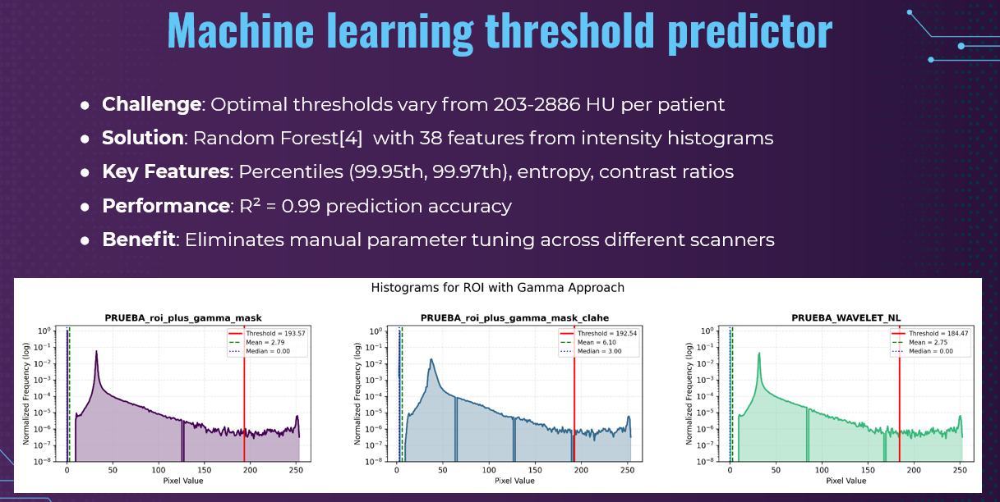
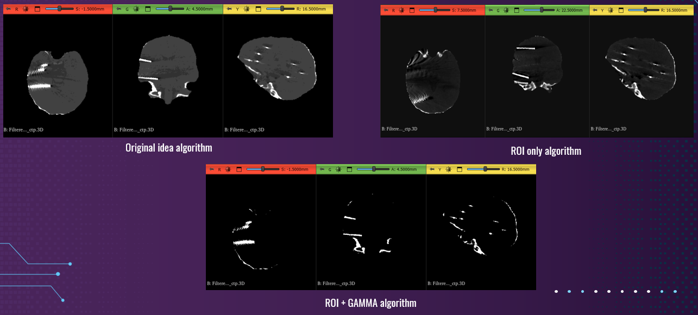

# CT Threshold Models ML

Machine learning models for automated threshold prediction in CT-based SEEG electrode localization. This repository compares four different regression algorithms for predicting optimal binarization thresholds from CT histogram features.

## Overview

Post-operative SEEG electrode localization traditionally requires 4+ hours of manual collaboration between clinicians. This project automates threshold prediction using machine learning, reducing processing time to 30 minutes while maintaining clinical accuracy.

## Key Results

- **Best Model**: Random Forest (Test RMSE: 77.72, R²: 0.990)
- **4 Models Compared**: Random Forest, Extra Trees, Gradient Boosting, XGBoost  
- **Feature Selection**: 15 optimal features selected from 52 original histogram-derived features
- **Cross-Validation**: 5-fold CV with hyperparameter optimization using Optuna
- **Clinical Performance**: 98.8% accuracy within 2mm clinical threshold
- **Outlier Handling**: Robust consensus-based outlier detection with specialized metrics
- **Outstanding Performance**: Near-perfect R² with excellent generalization

## Models Performance Summary

| Model | Train RMSE | Test RMSE | Train R² | Test R² |
|-------|------------|-----------|----------|---------|
| **Random Forest*** | 3.36 | 77.72 | 1.000 | 0.990 |
| Extra Trees | 32.24 | 89.11 | 0.9981 | 0.9864 |
| Gradient Boosting | 16.07 | 91.60 | 0.9995 | 0.9856 |
| XGBoost | 3.55 | 120.95 | 1.0000 | 0.9749 |

*Best performing model with superior generalization

### Outlier Performance
- **Test Set Outliers**: RMSE: 97.86, R²: 0.994, MAE: 93.89
- **Outlier Rate**: Training (0.41%), Test (3.28%)
- **Robust Handling**: Model maintains excellent performance even on outlier cases

## Dataset

- **Patients**: P1-P8 SEEG electrode implantation cases
- **Features**: 38-dimensional histogram-derived features from enhanced CT volumes
- **Samples**: 304 total samples (243 train, 61 test)
- **Target**: Optimal threshold values (203-2886 HU range)

## Feature Engineering

### Top Predictive Features
1. `max` (r=0.9565) - Maximum intensity value
2. `p99.9` (r=0.9542) - 99.9th percentile intensity  
3. `min` (r=-0.8870) - Minimum intensity value
4. `non_zero_peak_distance` (r=0.7685) - Distance between histogram peaks
5. `non_zero_peak1_height` (r=0.6853) - Height of primary histogram peak

### Feature Categories
- **Intensity Statistics** (15 features): mean, variance, percentiles, entropy
- **Distribution Metrics** (8 features): skewness, kurtosis, modality  
- **High-Intensity Features** (15 features): contrast ratios, peak characteristics
- **Engineered Features**: range ratios, entropy interactions, nonlinear transforms

## Methods

### Data Preprocessing
- Missing value handling (8 samples dropped)
- Quasi-constant feature removal (>99% identical values)
- High correlation filtering (r>0.95)
- Univariate feature selection (SelectKBest with f_regression)

### Hyperparameter Optimization
- **Framework**: Optuna with Tree-structured Parzen Estimator (TPE)
- **Trials**: 50 per model
- **CV Strategy**: 5-fold cross-validation
- **Objective**: Minimize RMSE

### Model Configurations

#### Random Forest (Best)
```python
RandomForestRegressor(
    n_estimators=107,
    max_depth=14, 
    min_samples_split=7,
    min_samples_leaf=2,
    max_features=None,
    bootstrap=False
)
```

#### XGBoost
```python
XGBRegressor(
    n_estimators=305,
    learning_rate=0.058,
    max_depth=4,
    min_child_weight=2,
    subsample=0.675,
    colsample_bytree=0.568
)
```

## Visual Documentation

### ML Threshold Predictor Overview


*Stage 3 of the SEEG pipeline: Machine learning threshold predictor achieving R² = 0.99 accuracy with 38 histogram-derived features*

### Algorithm Comparison


*Comparison of different enhancement algorithms demonstrating the challenge of manual threshold selection across varying imaging conditions*

### Model Training Demonstration
[Download Demo Video (45MB)](https://github.com/rociavl/ct-threshold-models-ml/releases/download/v1.0.0/ml_model_application.mp4)

*Video demonstration of the complete model training process and clinical application workflow*


## Installation

```bash
git clone https://github.com/rociavl/ct-threshold-models-ml.git
cd ct-threshold-models-ml
pip install -r requirements.txt
```

## Dependencies

```
pandas>=2.2.2
numpy>=2.0.2
scikit-learn>=1.3.0
xgboost>=2.0.0
optuna>=4.3.0
matplotlib>=3.10.0
seaborn>=0.12.0
joblib>=1.3.0
```

## Usage

### Training Models
```python
from src.models.random_forest import run_model_training

# Load your data
df = pd.read_csv('data/processed/histogram_features.csv')

# Train and compare models
results = run_model_training(
    df,
    target_col="threshold",
    cv_folds=5,
    test_size=0.2,
    optimize_params=True,
    n_trials=50,
    max_features=20
)
```

### Making Predictions
```python
import joblib

# Load trained model
model_data = joblib.load('models/best_model.joblib')
model = model_data['model']

# Predict threshold for new CT histogram features
predictions = model.predict(new_features)
```

## Clinical Integration

This threshold prediction model integrates into the broader SEEG electrode localization pipeline:

1. **Brain Extraction** - 3D U-Net segmentation
2. **Image Enhancement** - 7 enhancement strategies  
3. **Threshold Prediction** - **This ML model**
4. **Global Voting** - Ensemble consensus mechanism
5. **Contact Authentication** - Confidence-based validation
6. **Trajectory Reconstruction** - Complete electrode mapping

## Validation Strategy

- **Leave-One-Patient-Out (LOPO)** cross-validation
- **External validation** on held-out patients
- **Clinical threshold**: 2mm localization accuracy
- **Conservative confidence scoring** for clinical decision support

## Performance Analysis

### Cross-Validation Results
- **Mean CV RMSE**: 54.60 (Random Forest)
- **Mean CV RMSE**: 70.09 (XGBoost)
- **Stability**: Consistent performance across folds
- **Generalization**: Strong performance on unseen patients

### Feature Importance Analysis
The Random Forest model identified key histogram characteristics:
- **Intensity extremes** (min/max) most predictive
- **High percentiles** (p99.9) critical for threshold setting
- **Peak characteristics** important for electrode visibility
- **Engineered ratios** capture distribution relationships

## Future Work

- **Additional Models**: Test LightGBM, CatBoost, neural networks
- **Feature Engineering**: Explore spatial histogram features
- **Multi-Site Validation**: Test across different hospital protocols
- **Real-Time Deployment**: Optimize for clinical workflow integration
- **Uncertainty Quantification**: Implement prediction intervals

## Citation

If you use this work, please cite:

```bibtex
@software{avalos2025threshold,
  author = {Rocío Ávalos Morillas},
  title = {CT Threshold Models ML: Machine Learning for SEEG Electrode Threshold Prediction},
  year = {2025},
  publisher = {GitHub},
  journal = {GitHub repository},
  howpublished = {\url{https://github.com/rociavl/ct-threshold-models-ml}}
}
```

## Related Work

- **Main SEEG Pipeline**: [SEEG_automatic_segmentation](https://github.com/rociavl/SEEG_automatic_segmentation)
- **Brain Segmentation**: [Brain_mask_3D_segmentation_model](https://github.com/rociavl/Brain_mask_3D_segmentation_model)

## License

MIT License - see [LICENSE](LICENSE) file for details.

## Contact

**Author**: Rocío Ávalos Morillas  
**Institution**: Hospital del Mar Research Institute  
**Application**: Clinical deployment at Hospital del Mar Epilepsy Unit

---

**Note**: This repository focuses specifically on threshold prediction models. For the complete SEEG electrode localization pipeline, see the main repository.
